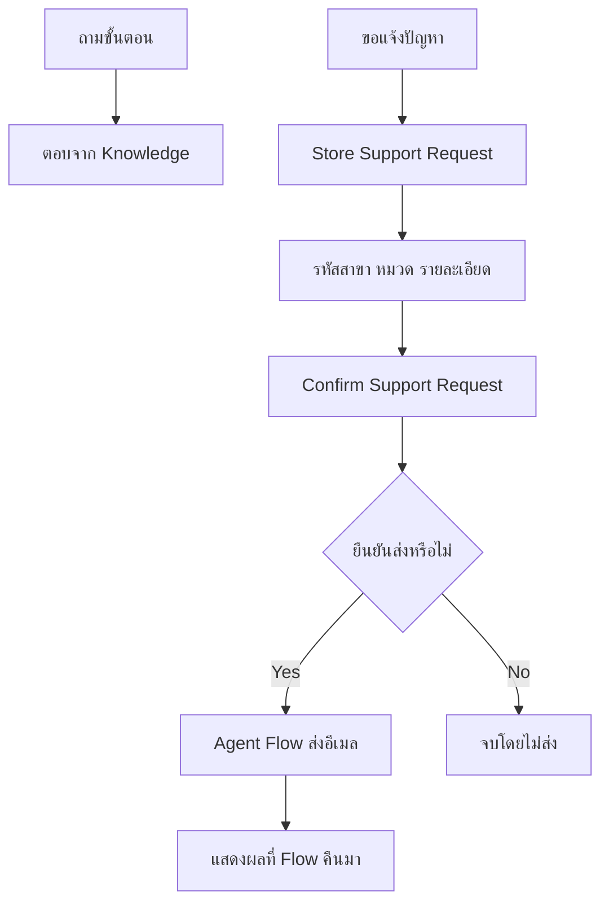

# Day 2 — CPAll Store Support Assistant

วันนี้เราจะสร้างผู้ช่วยสำหรับพนักงานสาขาทีละส่วน เริ่มจากถามวิธีเตรียมคำขอ อ่านคำตอบจาก Knowledge รับรายละเอียดปัญหา แล้วส่งสรุปทางอีเมลเมื่อผู้ใช้ยืนยัน

**ทุกสถานการณ์ รหัสสาขา และขั้นตอนในไฟล์นี้เป็นข้อมูลสมมติสำหรับการอบรม ไม่ใช่นโยบายหรือระบบจริงของ CPAll**

## ก่อนเริ่ม

- ใช้บัญชีงานที่เข้า [Microsoft Copilot Studio](https://copilotstudio.microsoft.com/) และสร้าง agent ใน environment ที่ IT เตรียมให้ได้
- ใช้ full Copilot Studio ที่รองรับ generative orchestration, Topics, uploaded Knowledge และ Agent Flow ตามที่วิทยากรตรวจแล้ว ไม่สลับไป Agent Builder หรือ Teams-only authoring ตามภาพจากคู่มืออื่น
- ดาวน์โหลดไฟล์ Knowledge สองไฟล์ด้านล่างลงเครื่อง การฝึกนี้ไม่ต้องสร้าง SharePoint site, Excel tracker หรือเชื่อม Day 1 flow
- ให้ผู้เรียนใช้ mailbox ของตัวเองเป็นผู้ส่งและผู้รับฝึกใน Exercise 5

> **License:** ต้องตรวจสอบก่อนเริ่มอบรมว่า Copilot Studio entitlement/capacity และสิทธิ์ Agent Flow รองรับกิจกรรมนี้ ใช้เพียง `Office 365 Outlook` Standard connector ใน flow แต่ Standard connector ไม่ได้แปลว่า Copilot Studio ใช้ได้ฟรี หรือทุก tenant พร้อมใช้ ต้องมี mailbox ที่ใช้งานได้ด้วย

> **Knowledge readiness:** Uploaded files ต้องใช้ Dataverse search และพื้นที่จัดเก็บใน Copilot Studio environment การตัด Dataverse for Teams lab ออกไม่ได้ตัด dependency นี้ [Microsoft Learn](https://learn.microsoft.com/en-us/microsoft-copilot-studio/knowledge-add-file-upload)

## เส้นทางการฝึก

| Exercise | ผลลัพธ์ที่เราจะได้ |
|---|---|
| [1. สร้างผู้ช่วยสาขา](./exercises/01-create-assistant/README.md) | Agent ที่อธิบายหน้าที่ตัวเองได้ |
| [2. เพิ่ม Knowledge](./exercises/02-add-knowledge/README.md) | คำตอบที่ตรวจเทียบเอกสารฝึกได้ |
| [3. สร้าง Topic รับคำขอ](./exercises/03-request-topic/README.md) | บทสนทนารับรหัสสาขา หมวด และรายละเอียด พร้อมทางเลือกสองเส้นทาง |
| [4. Entities และ Topic ที่ใช้ซ้ำ](./exercises/04-entities-and-confirmation/README.md) | รับคำพ้อง แปลงเป็นหมวดมาตรฐาน และยืนยันข้อมูลผ่าน Topic ย่อย |
| [5. ส่งสรุปด้วย Agent Flow](./exercises/05-email-agent-flow/README.md) | อีเมลหนึ่งฉบับหลังยืนยัน พร้อมผลตอบกลับในแชต |
| [6. เตรียมเผยแพร่และแชร์](./exercises/06-publish-and-share/README.md) | ทดสอบใน channel ที่อนุญาต หรือเรียนจาก instructor demo หากสิทธิ์ไม่พร้อม |

## ไฟล์สำหรับผู้เรียน

- [คู่มือรับคำขอสมมติ (.txt)](./files/cpall-store-support-guide.txt)
- [คำศัพท์และขอบเขตผู้ช่วย (.txt)](./files/cpall-support-terms.txt)
- [บทสนทนาฝึกและผลที่คาดหวัง](./files/sample-conversations.md)

อัปโหลดเฉพาะไฟล์ `.txt` สองไฟล์เป็น Knowledge ไม่อัปโหลดคู่มือ Exercise หรือบทสนทนาทดสอบ เพราะจะทำให้ agent อ้างคำตอบเฉลยแทนคู่มือ

## สิ่งที่เกิดขึ้นในหนึ่งคำขอ

**สถานะ:** เอกสารเป็น authoring package ที่ต้อง rehearsal ใน training tenant ก่อนสอน การอนุญาตส่งอีเมลและ publish ใน Exercise เป็นขั้นตอนที่ผู้เรียนทำระหว่างอบรม ไม่ใช่การอนุญาตให้สร้างหรือเปลี่ยน tenant ในระหว่างจัดทำเอกสาร
