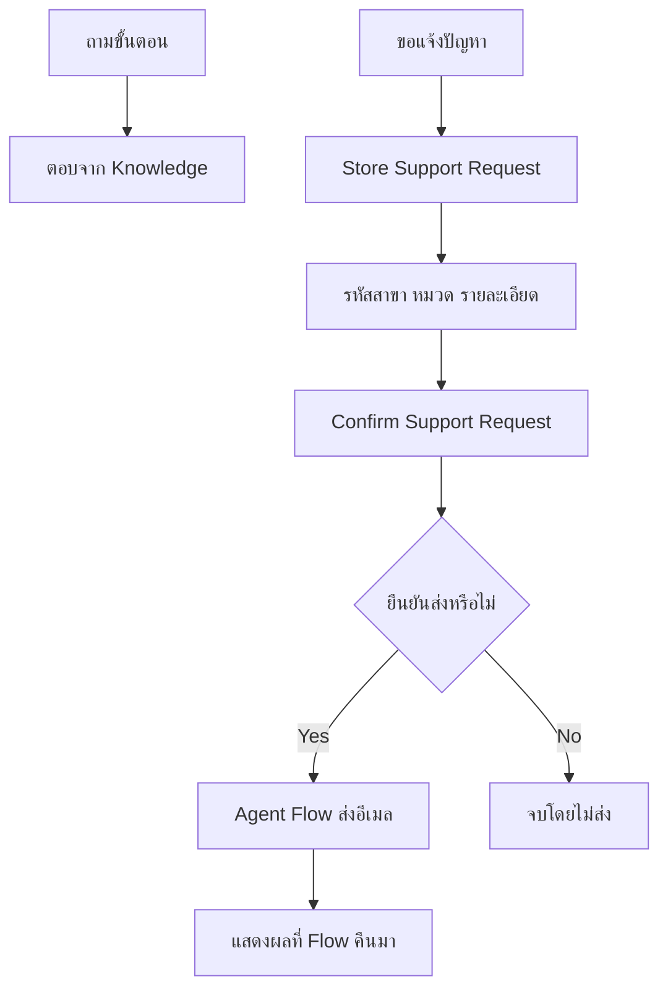

# Day 2 — CPAll Store Support Assistant

วันนี้เราจะสร้างผู้ช่วยสำหรับพนักงานสาขาทีละส่วน เริ่มจากถามวิธีเตรียมคำขอ อ่านคำตอบจาก Knowledge รับรายละเอียดปัญหา แล้วส่งสรุปทางอีเมลเมื่อผู้ใช้ยืนยัน

**ทุกสถานการณ์ รหัสสาขา และขั้นตอนในไฟล์นี้เป็นข้อมูลสมมติสำหรับการอบรม ไม่ใช่นโยบายหรือระบบจริงของ CPAll**

## ก่อนเริ่ม

- ใช้บัญชีและ `Copilot Studio environment` ที่ผู้จัดอบรมเตรียมให้
- ใช้ authoring experience ที่วิทยากร rehearsal แล้วสำหรับ Agent, Knowledge, Topics และ Agent Flow
- ดาวน์โหลดไฟล์ Knowledge สองไฟล์ด้านล่าง การฝึกนี้ไม่ต้องสร้าง SharePoint site, Excel tracker หรือเชื่อม Day 1 flow
- ใช้ mailbox ของตัวเองเป็นผู้ส่งและผู้รับฝึกใน Exercise 5

> **Learner prerequisite:** หากบัญชีหรือ environment ที่ผู้จัดเตรียมไว้เปิด capability ที่ระบุไม่ได้ ให้หยุดและแจ้งวิทยากร ไม่สร้าง environment ใหม่หรือเปลี่ยนเส้นทางเองระหว่างคลาส

> **Knowledge readiness:** Uploaded files ต้องใช้ search และ storage ที่พร้อมใน Copilot Studio environment วิทยากรต้องตรวจให้ไฟล์ทั้งสองขึ้นสถานะ Ready ก่อนเริ่ม [Microsoft Learn](https://learn.microsoft.com/en-us/microsoft-copilot-studio/knowledge-add-file-upload)

## เส้นทางการฝึก

| Exercise | ผลลัพธ์ที่เราจะได้ |
|---|---|
| [1. สร้างผู้ช่วยสาขา](./exercises/01-create-assistant/README.md) | Agent ที่อธิบายหน้าที่ตัวเองได้ |
| [2. เพิ่ม Knowledge](./exercises/02-add-knowledge/README.md) | คำตอบที่ตรวจเทียบเอกสารฝึกได้ |
| [3. สร้าง Topic รับคำขอ](./exercises/03-request-topic/README.md) | บทสนทนารับรหัสสาขา หมวด และรายละเอียด พร้อมทางเลือกสองเส้นทาง |
| [4. Entities และ Topic ที่ใช้ซ้ำ](./exercises/04-entities-and-confirmation/README.md) | รับคำพ้อง แปลงเป็นหมวดมาตรฐาน และยืนยันข้อมูลผ่าน Topic ย่อย |
| [5. ส่งสรุปด้วย Agent Flow](./exercises/05-email-agent-flow/README.md) | อีเมลหนึ่งฉบับหลังยืนยัน พร้อมผลตอบกลับในแชต |
| [6. เตรียมเผยแพร่และแชร์](./exercises/06-publish-and-share/README.md) | ทดสอบใน channel ที่อนุญาต หรือเรียนจาก instructor demo หากสิทธิ์ไม่พร้อม |

## ตารางเวลา

| Time | Activity |
|---|---|
| 09:00–09:15 | Copilot Studio fundamentals และภาพรวม journey |
| 09:15–10:15 | Exercises 1–2: Agent และ Knowledge |
| 10:15–10:30 | Break |
| 10:30–11:00 | Exercise 3: Topic รับคำขอ |
| 11:00–12:00 | Exercise 4: Entity, confirmation และ reusable Topic |
| 12:00–13:00 | Lunch |
| 13:00–14:30 | Exercise 5: Agent Flow, Yes/No tests และ evidence |
| 14:30–14:45 | Break |
| 14:45–15:15 | Exercise 6: publish/share ตามเส้นทางที่อนุญาต |
| 15:15–15:40 | Agent Builder overview และ instructor demo |
| 15:40–16:00 | Tool-choice recap และ Q&A |

รวม 330 นาทีสำหรับ instruction/activity, พัก 30 นาที และ lunch 60 นาที

## ไฟล์สำหรับผู้เรียน

- [คู่มือรับคำขอสมมติ (.txt)](./files/cpall-store-support-guide.txt)
- [คำศัพท์และขอบเขตผู้ช่วย (.txt)](./files/cpall-support-terms.txt)
- [บทสนทนาฝึกและผลที่คาดหวัง](./files/sample-conversations.md)

อัปโหลดเฉพาะไฟล์ `.txt` สองไฟล์เป็น Knowledge ไม่อัปโหลดคู่มือ Exercise หรือบทสนทนาทดสอบ เพราะจะทำให้ agent อ้างคำตอบเฉลยแทนคู่มือ

## สิ่งที่เกิดขึ้นในหนึ่งคำขอ

## สำหรับวิทยากร

- [Presentation outline: 36 teaching slides](./presentation-slide-outline.md)
- [Readiness และ rehearsal checklist](./instructor-readiness-checklist.md)
- [Agenda coverage และการปรับจาก Krungsri](./reference-topic-coverage.md)
- [เอกสาร Microsoft ที่ใช้ตรวจวิธีทำ](./sources-and-validation.md)

Agent Builder อยู่เฉพาะช่วง overview/demo ตอนท้าย ไม่มี sample file หรือ hands-on exercise เพิ่ม

**สถานะ:** เอกสารเป็น authoring package ที่ต้อง rehearsal ใน training tenant ก่อนสอน การอนุญาตส่งอีเมลและ publish ใน Exercise เป็นขั้นตอนที่ผู้เรียนทำระหว่างอบรม ไม่ใช่การอนุญาตให้สร้างหรือเปลี่ยน tenant ในระหว่างจัดทำเอกสาร
