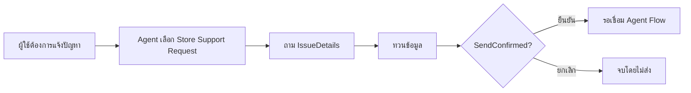

# แบบฝึกหัดที่ 4: ใช้ Topic รับเรื่องสั้น ๆ

Topic เหมือนแบบฟอร์มที่ Agent เลือกใช้ตามเจตนาของผู้ใช้ พลจะพาทุกคนสร้างแบบฟอร์มสั้น ๆ สำหรับรับรายละเอียดปัญหา ทวนคำตอบ และให้เลือก `ยืนยัน` หรือ `ยกเลิก` ก่อนส่งต่อ จากนั้นเชื่อม Topic เข้ากับ Instructions เพื่อให้ Agent เรียกใช้ได้ถูกงานครับ

> **License และสิทธิ์:** ต้องใช้ Topics และ generative orchestration ใน Copilot Studio environment ฝึกที่ผู้จัดอบรมเตรียมไว้ หาก Trigger ไม่มี **The agent chooses** ให้แจ้งวิทยากรและใช้เส้นทางสาธิต ไม่เปลี่ยน orchestration เอง Exercise นี้ยังไม่ส่งอีเมลและไม่ใช้ custom Entity

## Prerequisites

- Agent, Instructions และ Knowledge จาก Exercises 1–3
- เปิด Test panel ไว้เพื่อทดลองหลัง Save
- ใช้เพียงรายละเอียดสมมติ ไม่มีชื่อหรือข้อมูลส่วนบุคคล

## Practice 1: สร้าง Topic ที่ถามรายละเอียดหนึ่งช่อง

**Primary target:** สร้าง `Store Support Request` ที่ Agent เลือกจากเจตนาของผู้ใช้และเก็บ `IssueDetails` เป็น Text

1. เปิด **Topics > Add a topic > From blank** แล้วตั้งชื่อ:

   ```text
   Store Support Request
   ```

2. ตรวจว่า Trigger เป็น **The agent chooses** หากไม่ใช่ ให้ชี้ที่ Trigger เลือก **Change trigger > The agent chooses**
3. ใส่ Description ใน Trigger เพื่อบอกว่า Topic นี้ใช้เมื่อใด:

   ```text
   Use this topic when a user wants to report a store equipment issue or a difference between expected and counted delivery quantities. Collect and review IssueDetails, then ask the user to choose ยืนยัน or ยกเลิก; do not use it for general procedure questions answered from Knowledge.
   ```

4. เพิ่ม **Ask a question** node ด้วยข้อความ:

   ```text
   กรุณาอธิบายปัญหาสั้น ๆ เช่น เครื่องพิมพ์ฝึกไม่พิมพ์หลังเริ่มรอบเช้า
   ```

5. ตั้ง **Identify** เป็น **User's entire response**
6. ถัดลงมาในส่วน **Save response as** คลิกที่ชื่อตัวแปร `Var1` แล้วแทนที่ชื่อเดิมด้วยข้อความนี้:

   ```text
   IssueDetails
   ```

7. เพิ่ม **Send a message** แล้วแทรกตัวแปร `IssueDetails` จากเมนูตัวแปร ไม่พิมพ์วงเล็บแทนตัวแปร:

   ```text
   กรุณาตรวจรายละเอียดก่อนส่ง: {IssueDetails}
   ```

### Checkpoint

หยุดตรวจ Topic ก่อนทำต่อ: Trigger เป็น **The agent chooses** และ Description แยกงานรับเรื่องออกจากคำถามทั่วไป พร้อมมีคำถามเก็บ `IssueDetails` และข้อความทวนหรือไม่

## Practice 2: ขอคำยืนยันและแยกเส้นทางการสนทนา

**Primary target:** เก็บคำตอบแบบ Multiple choice options ใน `SendConfirmed` และให้ระบบสร้างเส้นทาง `ยืนยัน` กับ `ยกเลิก` โดยอัตโนมัติ

1. ใต้ข้อความทวน เพิ่ม **Ask a question**:

   ```text
   รายละเอียดถูกต้องและต้องการส่ง emailหรือไม่?
   ```

2. ตั้ง **Identify** เป็น **Multiple choice options**
3. ใน **Options for user** ใส่ตัวเลือกแรก:

   ```text
   ยืนยัน
   ```

4. เลือก **+ New option** แล้วใส่ตัวเลือกที่สอง:

   ```text
   ยกเลิก
   ```

5. ใน **Save response as** คลิกชื่อตัวแปรเดิมแล้วแทนที่ด้วยข้อความนี้:

   ```text
   SendConfirmed
   ```

6. ตรวจว่า Copilot Studio สร้างเส้นทาง `ยืนยัน` และ `ยกเลิก` ใต้คำถามให้อัตโนมัติ ไม่ต้องเพิ่ม **Condition** เอง
7. ในเส้นทาง `ยืนยัน` เพิ่ม Send a message:

   ```text
   ยืนยันแล้ว จะเริ่มกระบวนการส่ง email
   ```

8. ในเส้นทาง `ยกเลิก` เพิ่ม Send a message:

   ```text
   ยกเลิกคำขอนี้แล้ว ยังไม่มีการส่งอีเมล หากข้อมูลผิดให้เริ่มใหม่ครับ
   ```

9. ในเส้นทาง `All other conditions` เพิ่ม Send a message:

   ```text
   ข้อความไม่ตรงกับตัวเลือกที่กำหนด กรุณาเริ่มต้นใหม่
   ```
10. ปลายเส้นทาง topic ให้แน่ใจว่าได้ต่อ **End all topics** node เพื่อจบเส้นทางอย่างถูกต้อง
11. กด Save

### Checkpoint

 Multiple choice options สร้างเส้นทาง `ยืนยัน` และ `ยกเลิก` จาก `SendConfirmed` อย่างไร ทั้งสองเส้นทางยังต้องไม่มีการเรียกใช้งาน tool



## Practice 3: เชื่อม Topic กับ Instructions และทดสอบการเลือก

**Primary target:** เพิ่ม Topic reference ใน Instructions และพิสูจน์ว่า Agent เลือก `Store Support Request` เฉพาะเมื่อต้องรับเรื่อง

1. กลับไปที่ **Overview > Instructions > Edit** เลือกข้อความเดิมทั้งหมด แล้วแทนที่ด้วย Instructions ฉบับสมบูรณ์ต่อไปนี้:

   ```text
   # Role
   You are a fictional store-support training assistant for CPAll learners.

   # Language and style
   Reply in friendly, concise Thai. Keep visible product and field names in English.

   # Scope
   For unrelated requests, explain the supported scope.

   # Knowledge and data boundaries
   - Explain training procedures using the approved training Knowledge when it is added.
   - If the guide does not contain an answer, say so.
   - Do not invent policies, SLAs, contacts, prices, stock levels or ticket numbers.

   # Issue reporting
   When a user wants to report a fictional store equipment issue or delivery quantity difference, invoke [ADD Store Support Request TOPIC HERE] to collect the details and ask for confirmation.
   Do not invoke this topic for general procedure questions answered from Knowledge.
   ```

2. เลือกข้อความ `[ADD Store Support Request TOPIC HERE]` แล้วใช้ **+ Add > Topic > Store Support Request** เพื่อแทนที่ด้วย Topic reference หากไม่เห็น **+ Add** ให้พิมพ์ `/` แล้วเลือก Topic ตามเมนูที่ปรากฏ
3. ตรวจว่า `Store Support Request` แสดงเป็น Topic token หรือ resource reference ไม่ใช่ข้อความธรรมดา แล้ว Save Instructions
4. เปิด conversation ใหม่และเปิด activity map หรือ trace จากนั้นส่งข้อความ:

   ```text
   ต้องการแจ้งปัญหาเครื่องพิมพ์
   ```

5. ตรวจว่า Agent เลือก `Store Support Request` แล้วถาม `IssueDetails` จากนั้นทดลองตอบรายละเอียด
   ```text
   เครื่องพิมพ์นั้นไม่ทำงาน มีข้อความแสดงข้อผิดพลาดว่า "Paper Jam"
   ```

6. เลือก `ยกเลิก` เพื่อจบโดยไม่ส่ง
7. เปิด conversation ใหม่แล้วทดสอบคำขอรับเรื่องอีกแบบ:

   ```text
   อยากแจ้งว่าจำนวนสินค้าตัวอย่างที่ได้รับไม่ตรง
   ```

8. ตรวจว่า Agent เลือก Topic เดิม
9. จากนั้นเปิด conversation ใหม่อีกครั้งแล้วถามคำถามที่ควรตอบจาก Knowledge:

   ```text
   ถ้าสินค้าตัวอย่างมาไม่ครบ ต้องเตรียมข้อมูลอะไร
   ```

10. ตรวจ activity map หรือ trace ว่าสองคำขอแรกเรียก `Store Support Request` แต่คำถามสุดท้ายตอบจาก Knowledge โดยไม่เรียก Topic

### Checkpoint

Instructions มี Topic reference จริง และผลทดสอบแยกได้หรือไม่ว่าเรื่องที่ต้องการส่งต่อเรียก `Store Support Request` ส่วนคำถามขั้นตอนทั่วไปใช้ Knowledge

## Summary

เราได้ Topic ที่ Agent เลือกจากเจตนาของผู้ใช้ รับข้อมูล Text หนึ่งค่าโดยไม่ขอข้อมูลส่วนบุคคล และให้ผู้ใช้เลือก `ยืนยัน` หรือ `ยกเลิก` ก่อนทำงานต่อแล้วครับ ช่วงถัดไปพลจะพาเพิ่มเงื่อนไขการส่งอีเมลและเชื่อมเส้นทาง `ยืนยัน` กับ Agent Flow ส่วน `ยกเลิก` ยังคงจบโดยไม่ส่ง

[ก่อนหน้า](./03-add-knowledge.md) · [ถัดไป: Agent Flow](./05-agent-flow-and-test.md) · [สารบัญ](../index.md)
