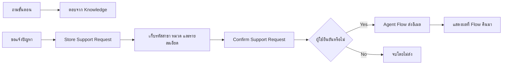

วันนี้เราจะสร้างผู้ช่วยสำหรับพนักงานสาขาทีละส่วน เหมือนฝึกพนักงานหน้าร้านคนใหม่ให้รู้หน้าที่ อ่านคู่มือ รับข้อมูลให้ครบ ถามยืนยัน และส่งเรื่องต่อเฉพาะเมื่อได้รับอนุญาต

**ทุกสถานการณ์ รหัสสาขา และขั้นตอนในเว็บไซต์นี้เป็นข้อมูลสมมติสำหรับการอบรม ไม่ใช่นโยบายหรือระบบจริงของ CPAll**

> **License และ environment:** ใช้บัญชีและ `Copilot Studio environment` ที่ผู้จัดอบรมเตรียมให้ การอัปโหลด Knowledge ต้องมี search/storage ที่พร้อม ส่วน Exercise 5 ใช้ `Office 365 Outlook` Standard connector กับ mailbox ของบัญชีฝึก สิทธิ์และ policy ขององค์กรยังต้องผ่านการตรวจจากฝ่าย IT หรือผู้ดูแลระบบ

## สิ่งที่ต้องเตรียม

- เข้า [Microsoft Copilot Studio](https://copilotstudio.microsoft.com/) ด้วยบัญชีฝึกได้
- ทราบชื่อ environment ที่วิทยากรกำหนด และไม่สร้าง environment ใหม่ระหว่างคลาส
- ดาวน์โหลด [ไฟล์ Knowledge สองไฟล์](./resources/downloads.md) ไว้ในเครื่อง
- ใช้ mailbox ของตัวเองเป็นผู้ส่งและผู้รับฝึกใน Exercise 5
- ใช้ authoring experience ที่วิทยากร rehearsal แล้วสำหรับ Agent, Knowledge, Topics และ Agent Flow
- เปิดเฉพาะ channel และ authentication ที่ผู้จัดอบรมอนุญาตใน Exercise 6

> **⚠️ Readiness checkpoint:** หากบัญชีหรือ environment เปิด capability ที่ระบุไม่ได้ ให้หยุดและแจ้งวิทยากร ไม่เปลี่ยน environment, authentication, connection หรือ policy เองระหว่างคลาส

## เส้นทางการฝึก

ทำตามลำดับ เพราะแต่ละ Exercise ต่อความสามารถเข้ากับ Agent ตัวเดิม

  <a href="./exercises/01-create-assistant"><strong>1 · Agent + Instructions</strong>สร้างผู้ช่วยที่อธิบายหน้าที่และขอบเขตได้</a>
  <a href="./exercises/02-add-knowledge"><strong>2 · Knowledge</strong>ตอบคำถามโดยตรวจเทียบกับคู่มือฝึก</a>
  <a href="./exercises/03-request-topic"><strong>3 · Topic</strong>รับรหัสสาขา หมวด และรายละเอียดคำขอ</a>
  <a href="./exercises/04-entities-and-confirmation"><strong>4 · Entity + Variable</strong>เข้าใจคำพ้องและยืนยันข้อมูลก่อนส่ง</a>
  <a href="./exercises/05-email-agent-flow"><strong>5 · Agent Flow</strong>ส่งสรุปทางอีเมลเฉพาะเส้นทางที่ยืนยัน</a>
  <a href="./exercises/06-publish-and-share"><strong>6 · Publish + Channel</strong>ทดสอบในช่องทางที่ได้รับอนุญาต</a>

## ตารางเวลา

| Time | Activity |
|---|---|
| 09:00–09:15 | Copilot Studio fundamentals และภาพรวม journey |
| 09:15–10:15 | Exercises 1–2: Agent, Instructions และ Knowledge |
| 10:15–10:30 | Break |
| 10:30–11:00 | Exercise 3: Topic รับคำขอ |
| 11:00–12:00 | Exercise 4: Entity, Variables, confirmation และ reusable Topic |
| 12:00–13:00 | Lunch |
| 13:00–14:30 | Exercise 5: Agent Flow, Yes/No tests และ evidence |
| 14:30–14:45 | Break |
| 14:45–15:15 | Exercise 6: publish/share ตามเส้นทางที่อนุญาต |
| 15:15–15:40 | Agent Builder overview และ instructor demo |
| 15:40–16:00 | Tool-choice recap และ Q&A |

รวม 330 นาทีสำหรับ instruction/activity, พัก 30 นาที และ lunch 60 นาที

## ไฟล์สำหรับผู้เรียน

- [คู่มือรับคำขอสมมติ (.txt)](/downloads/cpall-store-support-guide.txt)
- [คำศัพท์และขอบเขตผู้ช่วย (.txt)](/downloads/cpall-support-terms.txt)
- [บทสนทนาฝึกและผลที่คาดหวัง](./resources/sample-conversations.md)
- [สไลด์ผู้เรียน Copilot Studio Day 2](/downloads/CPAll-Copilot-Studio-Day-2.pptx)

อัปโหลดเป็น Knowledge เฉพาะไฟล์ `.txt` สองไฟล์ ไม่อัปโหลดสไลด์ คู่มือ Exercise หรือบทสนทนาทดสอบ เพราะจะทำให้ agent อ้างคำตอบเฉลยแทนคู่มือ

## สิ่งที่เกิดขึ้นในหนึ่งคำขอ

เมื่อจบวันนี้ ผู้เรียนจะมี Agent รุ่นแรกที่ตอบจากคู่มือ รับคำขอเป็นลำดับ เข้าใจคำพ้อง ขอการยืนยัน และเรียก Flow เฉพาะเส้นทางที่อนุญาต พร้อมรู้ว่าจุดใดต้องหยุดและขอความช่วยเหลือเมื่อ environment ไม่พร้อม

## ขอบเขตการเผยแพร่และการทดสอบ

Exercise 6 ใช้ channel ที่ผู้จัดอบรมยืนยันเท่านั้น หากบัญชีฝึก publish หรือเปิด channel ไม่ได้ ให้เรียนผ่าน instructor demo โดยไม่เปลี่ยน authentication เอง การสร้างเว็บไซต์นี้ไม่ได้เปลี่ยน tenant, ส่งอีเมล, publish Agent หรือพิสูจน์ว่า Knowledge และ Flow พร้อมใช้งานจริง

Agent Builder อยู่เฉพาะช่วง overview/demo ตอนท้าย ไม่มี hands-on exercise เพิ่มและไม่เป็นเงื่อนไขการผ่าน Day 2

## Microsoft Learn references

- [Copilot Studio overview](https://learn.microsoft.com/en-us/microsoft-copilot-studio/fundamentals-what-is-copilot-studio)
- [Add uploaded files as Knowledge](https://learn.microsoft.com/en-us/microsoft-copilot-studio/knowledge-add-file-upload)
- [Topic triggers](https://learn.microsoft.com/en-us/microsoft-copilot-studio/authoring-triggers)
- [Entities and slot filling](https://learn.microsoft.com/en-us/microsoft-copilot-studio/advanced-entities-slot-filling)
- [Ask a question](https://learn.microsoft.com/en-us/microsoft-copilot-studio/authoring-ask-a-question)
- [Topic inputs and outputs](https://learn.microsoft.com/en-us/microsoft-copilot-studio/advanced-managing-topic-inputs-outputs)
- [Create an Agent Flow](https://learn.microsoft.com/en-us/microsoft-copilot-studio/advanced-flow-create)
- [Office 365 Outlook connector](https://learn.microsoft.com/en-us/connectors/office365/)
- [Publish to Teams and Microsoft 365 Copilot](https://learn.microsoft.com/en-us/microsoft-copilot-studio/publication-add-bot-to-microsoft-teams)
