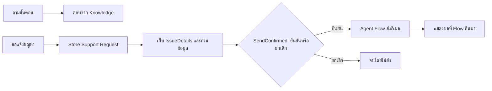

วันนี้พลจะพาทุกคนสร้าง Agent สำหรับพนักงานสาขาทีละส่วนครับ เหมือนฝึกพนักงานหน้าร้านคนใหม่ให้รู้หน้าที่ อ่านคู่มือ รับข้อมูลให้ครบ ถามยืนยัน และส่งเรื่องต่อเฉพาะเมื่อได้รับอนุญาต โดยการทำงานจะเป็นขั้นตอนตามลำดับในแต่ละ Exercise และตรวจสอบผลลัพธ์ในแต่ละช่วงก่อนไปต่อใน exercise ถัดไป

**ทุกสถานการณ์ รหัสสาขา และขั้นตอนในเว็บไซต์นี้เป็นข้อมูลสมมติสำหรับการอบรม ไม่ใช่นโยบายหรือระบบจริงของ CPAll ครับ**

> **License และ environment:** ใช้บัญชีและ `Copilot Studio environment` ที่ผู้จัดอบรมเตรียมให้ การอัปโหลด Knowledge ต้องมี search/storage ที่พร้อม ส่วน Exercise 5 ใช้ `Office 365 Outlook` Standard connector กับ mailbox ของบัญชีฝึก สิทธิ์และ policy ขององค์กรยังต้องผ่านการตรวจจากฝ่าย IT หรือผู้ดูแลระบบ

## สิ่งที่ต้องเตรียม

- เข้า [Microsoft Copilot Studio](https://copilotstudio.microsoft.com/) ด้วยบัญชีฝึกได้
- ทราบชื่อ environment ที่วิทยากรกำหนด และไม่สร้าง environment ใหม่ระหว่างคลาส
- ดาวน์โหลด [ชุดไฟล์ Day 2 (.zip)](/downloads/cpall-day2-knowledge-sample-files.zip) ซึ่งมีสไลด์ `.pdf` และไฟล์ตัวอย่าง `.txt` สองไฟล์ แตกไฟล์ไว้ในเครื่องเพื่อใช้ `.txt` ใน Exercise 3

> **⚠️ Readiness checkpoint:** หากบัญชีหรือ environment เปิด capability ที่ระบุไม่ได้ ให้หยุดและแจ้งวิทยากร ไม่เปลี่ยน environment, authentication, connection หรือ policy เองระหว่างคลาส

## เส้นทางการฝึก

พลชวนทำตามลำดับนะครับ เพราะแต่ละ Exercise ต่อความสามารถเข้ากับ Agent ตัวเดิมตลอดทั้งวัน หากช่วงใดยังไม่ผ่าน Checkpoint ให้หยุดดูสาเหตุ หรือใช้เส้นทางสาธิต/รอสิทธิ์ตามที่หน้าบทเรียนระบุ

  <a href="./exercises/01-create-assistant"><strong>1 · Portal + Agent</strong>เลือก environment และเริ่มสร้าง Agent</a>
  <a href="./exercises/02-instructions-and-test"><strong>2 · Instructions + Test</strong>กำหนดหน้าที่และตรวจขอบเขตการทำงาน</a>
  <a href="./exercises/03-add-knowledge"><strong>3 · Knowledge</strong>ตอบจากคู่มือและตรวจทั้งเรื่องที่มี/ไม่มีข้อมูล</a>
  <a href="./exercises/04-request-topic"><strong>4 · Topic</strong>รับรายละเอียดหนึ่งช่องและถาม ยืนยัน/ยกเลิก</a>
  <a href="./exercises/05-agent-flow-and-test"><strong>5 · Agent Flow + Test</strong>เรียกใช้ระบบเฉพาะทางเลือก ยืนยัน และพิสูจน์ผลใน Inbox</a>
  <a href="./exercises/06-publish-and-share"><strong>6 · Publish + Channel</strong>ทดสอบในช่องทางที่ได้รับอนุญาต</a>

## ตารางเวลา

| Time | Activity |
|---|---|
| 09:00–10:30 | Exercises 1–2: Portal, environment, สร้าง Agent, Instructions และทดสอบการทำงานครั้งแรก |
| 10:30–10:45 | Break |
| 10:45–12:00 | Exercise 3: Knowledge และตรวจคำตอบกับ source |
| 12:00–13:00 | Lunch |
| 13:00–13:25 | Exercise 4: Topic รับ `IssueDetails` และให้เลือก ยืนยัน/ยกเลิก |
| 13:25–14:05 | Exercise 5: สร้าง Agent Flow ใหม่และเชื่อมความเข้าใจจาก Day 1 |
| 14:05–14:30 | Exercise 5: เชื่อม Topic, ทดสอบ ยืนยัน/ยกเลิก และ evidence |
| 14:30–14:45 | Break |
| 14:45–15:15 | Exercise 6: publish/share ตามเส้นทางที่อนุญาต |
| 15:15–15:35 | Copilot Studio เทียบกับ Microsoft 365 Copilot Agent Builder และ instructor demo |
| 15:35–15:50 | AI Builder `Run a prompt` ใน Power Automate flow: instructor demo และ human review |
| 15:50–16:00 | Review และ Q&A |

## ไฟล์สำหรับผู้เรียน

- [ดาวน์โหลดชุดไฟล์ Day 2: สไลด์ PDF และตัวอย่างสองไฟล์ (.zip)](/downloads/cpall-day2-knowledge-sample-files.zip)
- [คู่มือรับคำขอสมมติ (.txt)](/downloads/cpall-store-support-guide.txt)
- [คำศัพท์และขอบเขต Agent (.txt)](/downloads/cpall-support-terms.txt)
- [บทสนทนาฝึกและผลที่คาดหวัง](./resources/sample-conversations.md)
- [สไลด์ผู้เรียน Copilot Studio Day 2 (.pdf)](/downloads/CPAll-Copilot-Studio-Day-2-final.pdf)

พลชวนแตกไฟล์ `.zip` ก่อน สไลด์ `.pdf` มีไว้เปิดอ่านประกอบการเรียน ส่วน Knowledge ให้อัปโหลดเฉพาะไฟล์ `.txt` สองไฟล์ ไม่อัปโหลดไฟล์ `.zip`, `.pdf`, คู่มือ Exercise หรือบทสนทนาทดสอบ เพราะจะทำให้ Agent อ้างสไลด์หรือคำตอบเฉลยแทนคู่มือ

## สิ่งที่เกิดขึ้นในหนึ่งคำขอ

```mermaid
flowchart LR
    A["ถามขั้นตอน"] --> B["ตอบจาก Knowledge"]
    C["ขอแจ้งปัญหา"] --> D["Store Support Request"]
    D --> E["เก็บ IssueDetails และทวนข้อมูล"]
    E --> G{"SendConfirmed: ยืนยันหรือยกเลิก"}
    G -->|ยืนยัน| H["Agent Flow ส่งอีเมล"]
    G -->|ยกเลิก| I["จบโดยไม่ส่ง"]
    H --> J["แสดงผลที่ Flow คืนมา"]
```

เมื่อจบวันนี้ พวกเราจะมี Agent รุ่นแรกที่ตอบจากคู่มือ รับคำขอเป็นลำดับ ขอการยืนยัน และเรียก Flow เฉพาะเส้นทางที่อนุญาต พร้อมรู้ว่าจุดใดต้องหยุดและขอความช่วยเหลือ

## Microsoft Learn references

- [Copilot Studio overview](https://learn.microsoft.com/en-us/microsoft-copilot-studio/fundamentals-what-is-copilot-studio)
- [Add uploaded files as Knowledge](https://learn.microsoft.com/en-us/microsoft-copilot-studio/knowledge-add-file-upload)
- [Topic triggers](https://learn.microsoft.com/en-us/microsoft-copilot-studio/authoring-triggers)
- [Ask a question](https://learn.microsoft.com/en-us/microsoft-copilot-studio/authoring-ask-a-question)
- [Agent flow overview](https://learn.microsoft.com/en-us/microsoft-copilot-studio/flows-overview)
- [Modify an existing flow for an agent](https://learn.microsoft.com/en-us/microsoft-copilot-studio/flow-modify-use-with-agent)
- [Office 365 Outlook connector](https://learn.microsoft.com/en-us/connectors/office365/)
- [Publish to Teams and Microsoft 365 Copilot](https://learn.microsoft.com/en-us/microsoft-copilot-studio/publication-add-bot-to-microsoft-teams)
- [Agent Builder and Copilot Studio comparison](https://learn.microsoft.com/en-us/microsoft-365/copilot/extensibility/copilot-studio-experience)
- [Build with Agent Builder](https://learn.microsoft.com/en-us/microsoft-365/copilot/extensibility/agent-builder-build-agents)
- [Use a prompt in Power Automate](https://learn.microsoft.com/en-us/ai-builder/use-a-custom-prompt-in-flow)
